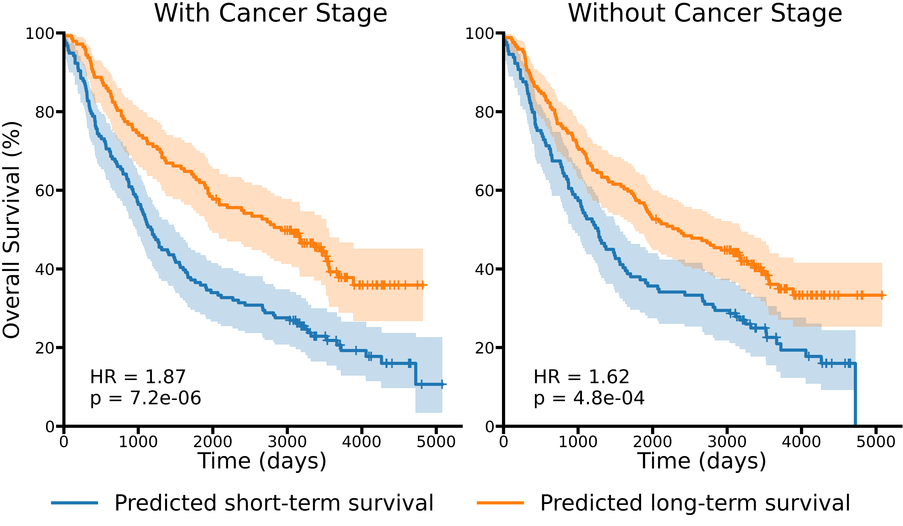

# HiGINE - a Hierarchical Graph Isomorphism Network with Edge features

[](https://doi.org/10.1007/978-3-032-31936-4_6)
[](https://arxiv.org/abs/2512.08572)
[](LICENSE)
[](https://www.python.org/)
[](https://pytorch.org/)

HiGINE is a hierarchical graph neural network for lung cancer survival prediction from multiplex immunofluorescence images.

## Abstract

The tumor microenvironment (TME) has emerged as a promising source of prognostic biomarkers. To fully leverage its potential, analysis methods must capture complex interactions between different cell types. We propose HiGINE - a hierarchical graph-based approach to predict patient survival (short vs. long) from TME characterization in multiplex immunofluorescence (mIF) images and enhance risk stratification in lung cancer. Our model encodes both local and global inter-relations in cell neighborhoods, incorporating information about cell types and morphology. Multimodal fusion, aggregating cancer stage with mIF-derived features, further boosts performance. We validate HiGINE on two public datasets, demonstrating improved risk stratification, robustness, and generalizability.

## Paper & Citation

This repository contains the code for the following publication:

**From Cells to Survival: Hierarchical Analysis of Cell Inter-relations in Multiplex Microscopy for Lung Cancer Prognosis**<br>
Olle Edgren Schüllerqvist, Jens Baumann, Joakim Lindblad, Love Nordling, Artur Mezheyeuski, Patrick Micke, Nataša Sladoje<br>
*Pattern Recognition* (ICPR 2026), Lecture Notes in Computer Science, Springer, 2026, pp. 81–91, [doi](https://doi.org/10.1007/978-3-032-31936-4_6), [arXiv](https://arxiv.org/abs/2512.08572)

If you use this code or find it useful, please cite:

```bibtex
@inproceedings{edgrenschullerqvist2026higine,
        title     = {From Cells to Survival: Hierarchical Analysis of Cell Inter-relations in Multiplex Microscopy for Lung Cancer Prognosis},
        author    = {Edgren Sch{\"u}llerqvist, Olle and Baumann, Jens and Lindblad, Joakim and Nordling, Love and Mezheyeuski, Artur and Micke, Patrick and Sladoje, Nata{\v{s}}a},
        booktitle = {Pattern Recognition (ICPR 2026)},
        series    = {Lecture Notes in Computer Science},
        publisher = {Springer Nature Switzerland},
        address   = {Cham},
        year      = {2026},
        pages     = {81--91},
        isbn      = {978-3-032-31936-4},
        doi       = {10.1007/978-3-032-31936-4_6}
}
```

## Installation & Requirements

This code was developed and tested on Python 3.12, PyTorch 2.5.1, CUDA 12.4 using an AMD Epyc 7742 CPU and an NVIDIA A100 GPU. To install HiGINE, follow the instructions below.

1. Clone the repository:

```bash
git clone https://github.com/MIDA-group/HiGINE.git
cd HiGINE
```

2. Install dependencies:

```bash
pip install -r requirements.txt
```

## Data

HiGINE was validated on two publicly available datasets. Information about and instructions for downloading and setting up each dataset are provided below.

### Dataset 1 — mIF Cohort

A multiplex immunofluorescence (mIF) cohort of 298 non-small cell lung cancer (NSCLC) patients (542 samples), collected at the Department of Immunology, Genetics and Pathology at Uppsala University, Sweden. See the original publication for more information:

**Spatial Immunophenotyping of the Tumour Microenvironment in Non-Small Cell Lung Cancer**<br>
Max Backman, Carina Strell, Amanda Lindberg, Johanna S. M. Mattsson, Hedvig Elfving, Hans Brunnström, Aine O'Reilly, Martina Bosic, Miklos Gulyas, Johan Isaksson, Johan Botling, Klas Kärre, Karin Jirström, Kristina Lamberg, Fredrik Pontén, Karin Leandersson, Artur Mezheeyeuski, Patrick Micke<br>
*European Journal of Cancer*, vol. 185, pp. 40–52, 2023, [doi](https://doi.org/10.1016/j.ejca.2023.02.012)

**Access:** The cell data is available at [this Zenodo repository](https://doi.org/10.5281/zenodo.20727573). The clinical and survival data is available at [this GitHub repository](https://github.com/MIDA-group/lung_cancer_BOMI2_dataset). Both are publicly available under a [Creative Commons Attribution 4.0 International](https://creativecommons.org/licenses/by/4.0/) license.

**Setup:** Run the provided script to download and place the dataset under `data/mif/`:

```bash
python scripts/download_mIF_data.py
```

Resulting directory structure:

```
data/
└── mif/
    ├── cell_data.csv
    ├── clinical_data.csv
    └── folds/
        └── split_{0..9}_{train,val,test,train_val}.csv
```

#### Ethical Statement

The data was collected in compliance with the Declaration of Helsinki and the Swedish Ethical Review Act, approved by the Ethical Review Board in Uppsala (approval #2012/532).

---

### Dataset 2 — IMC Cohort

An imaging mass cytometry (IMC) cohort of 416 NSCLC patients (single sample per patient). See the original publication for more information:

**Single-Cell Spatial Landscapes of the Lung Tumour Immune Microenvironment**<br>
Mark Sorin, Morteza Rezanejad, Elham Karimi, Benoit Fiset, Lysanne Desharnais, Lucas J. M. Perus, Simon Milette, Miranda W. Yu, Sarah M. Maritan, Samuel Doré, Émilie Pichette, William Enlow, Andréanne Gagné, Yuhong Wei, Michele Orain, Venkata S. K. Manems, Roni Rayes, Peter M. Siegel, Sophie Camilleri-Broët, Pierre Olivier Fiset, Patrice Desmeuless, Jonathan D. Spicer, Daniela F. Quail, Philippe Joubert & Logan A. Walsh<br>
*Nature*, vol. 614, no. 7948, pp. 548–554, 2023, [doi](https://doi.org/10.1038/s41586-022-05672-3)

**Access:** The dataset is registered at [this Zenodo repository](https://doi.org/10.5281/zenodo.7383627) under a [Creative Commons Attribution 4.0 International](https://creativecommons.org/licenses/by/4.0/) license.

**Setup:** Run the provided script to download the raw archive and derive the flat CSVs/fold splits under `data/imc/`:

```bash
python scripts/download_IMC_data.py
```

Resulting directory structure:

```
data/
└── imc/
    ├── cell_data.csv
    ├── clinical_data.csv
    ├── folds/
    │   └── split_{0..4}_{train,val,test}.csv
    └── raw/                  # downloaded archive, kept for re-processing if needed
```

Note: the patient-to-fold assignment (`scripts/imc_5parts.csv`) is embedded reference data rather than freshly derived.

#### Ethical Statement

As stated in the original publication: The protocols for human sample biobanking were approved (ethics, scientific and final) through the IUCPQ Biobank, protocol number IRB #2022-3474, 22090, and the MUHC protocol numbers IRB #2014-1119 and 2019-5253. Additional ethical approval was not required as confirmed by the license attached to the open-access data.

## Repository Structure

```
HiGINE/
├── src/                         # the 5-step pipeline and the baseline (see Repository Usage below)
│   ├── subsample.py             # step 1: sample subgraph-pointclouds from cell data
│   ├── make_graphs.py           # step 2: build subgraphs and core graphs
│   ├── train_subgraphs.py       # step 3: train the subgraph-level model
│   ├── train_coregraphs.py      # step 4: train the core-level model
│   ├── aggregation_patient.py   # step 5: aggregate predictions to patient level
│   ├── shallowlearning_baseline.py  # non-graph baseline classifiers (SVC, k-NN, logreg)
│   └── utils/                   # model definition and shared training/graph utilities
├── scripts/                     # data acquisition and figure generation, outside the pipeline
│   ├── download_mIF_data.py     # downloads Dataset 1 (mIF) into data/mif/
│   ├── download_IMC_data.py     # downloads + derives Dataset 2 (IMC) into data/imc/
│   ├── imc_5parts.csv           # static reference data: IMC patient/fold-part assignment
│   └── generate_kaplan_meier.py # Kaplan-Meier figure from train_coregraphs.py results
├── settings/
│   ├── mif/                     # Dataset 1 config (yaml) for every step above
│   └── imc/                     # Dataset 2 config (yaml) for every step above
├── data/                        # downloaded/derived data (gitignored, created by you)
│   ├── mif/                     # cell_data.csv, clinical_data.csv, folds/
│   └── imc/                     # cell_data.csv, clinical_data.csv, folds/, raw/
├── samples/                     # subsample.py / make_graphs.py output (gitignored)
├── results/                     # train_subgraphs.py / train_coregraphs.py / aggregation_patient.py output (gitignored)
├── figures/                     # figures referenced by this README (e.g. KM_plot.png)
├── requirements.txt
├── LICENSE
└── README.md
```

## Repository Usage

The code to train and evaluate models is executed in 5 steps of a pipeline, as outlined below. Every step reads its parameters from a yaml config file in `settings/mif/` or `settings/imc/` — see [Reproducibility & Hyperparameters](#reproducibility--hyperparameters) below for how to select which one. The written execution times can serve as a guide for run-time of the different components (note that this was recorded on the hardware and package versions indicated earlier).

Before running the pipeline, download the dataset(s) you want to use — see [Data](#data) above for `scripts/download_mIF_data.py` / `scripts/download_IMC_data.py`.

### Generate Subsamples

First, we sample subgraph-pointclouds from the cell data (cell positions only).

```bash
# Default output: samples/subsamples
python src/subsample.py
# Time: ~2 min for Dataset 1 using default parameters.
```

### Generate Graphs

Second, we generate graphs from the subsamples.

```bash
# Default output: samples/graphs
python src/make_graphs.py
# Time: ~6 min for Dataset 1 using default parameters.
```

### Subsample-Level Model Training

Third, we train the model operating at the subsample-level.

```bash
# Default output: results/train_subgraphs
python src/train_subgraphs.py
# Time: ~3 h 36 min for Dataset 1 using default parameters.
```

### Core-Level Model Training

Fourth, we train the model operating at the core-level.

```bash
# Default output: results/train_subgraphs/train_coregraphs
python src/train_coregraphs.py
# Time: ~37 min for Dataset 1 using default parameters.
```

### Patient Aggregation

Finally, we aggregate results over multiple cores and predictions per patient.

```bash
# Default output: results/train_subgraphs/train_coregraphs
python src/aggregation_patient.py
# Time: ~2 min for Dataset 1 using default parameters.
```

### Baseline & Figures (optional)

Two additional scripts are provided for comparison and visualization, and are config-driven the same way as the 5 steps above:

```bash
# Non-graph baseline classifiers (SVC, k-NN, logistic regression) trained on
# patient-aggregated cell features
python src/shallowlearning_baseline.py

# Kaplan-Meier survival plot comparing two train_coregraphs.py result sets
python scripts/generate_kaplan_meier.py
```

The Kaplan-Meier script draws one panel per result set listed under `CORE_RESULTS` in its config. The figure under [Results](#results) compares two: the run above and a second one with `ADD_STAGE: False`, i.e. without cancer stage fusion. Repeat step 4 with that setting and a new `--results-path`, then point `CORE_RESULTS` at the two result directories.

### Reproducibility & Hyperparameters

The hyperparameters used to reach the results recorded in the paper can be found in the respective yaml config files in `settings/mif/` (Dataset 1) and `settings/imc/` (Dataset 2). Every script in `src/` (and `scripts/`) accepts a `--parameters-file` flag to select which config file to use:

```bash
python src/subsample.py --parameters-file settings/imc/subsample.yaml
python src/make_graphs.py --parameters-file settings/imc/make_graphs.yaml
python src/train_subgraphs.py --parameters-file settings/imc/train_subgraphs.yaml
python src/train_coregraphs.py --parameters-file settings/imc/train_coregraphs.yaml
python src/aggregation_patient.py --parameters-file settings/imc/aggregation_patient.yaml
```

If `--parameters-file` is not given, the config files we used for Dataset 1 (`settings/mif/`) in the final results of the paper are selected by default. Although all hyperparameters are available for the main results of the paper, there are still random elements during subsample generation and model training that may affect the exact numbers reached.

The training scripts accept a few further flags for varying a single run without editing its config: `--results-path` overrides the output directory, `--stdin-overrides` reads extra yaml settings from stdin and merges them over the config file, and `train_subgraphs.py --no-train` reuses an existing model for inference only. Note that every step refuses to start if its output directory already exists, so re-running one means either a new `--results-path` or removing the old directory first.

## Results

HiGINE achieves competitive survival prediction performance and risk stratification. Full results and analysis are available in the [paper](https://arxiv.org/abs/2512.08572).

| Dataset | AUROC | C-index |
|---------|-------|---------|
| Dataset 1 — mIF Cohort | 0.690 | 0.617 |
| Dataset 2 — IMC Cohort | 0.703 | 0.632 |



## Acknowledgements

This work is supported by Swedish Cancer Society projects 22 2353 Pj and 22 2357 Pj, the Swedish Research Council grant 2022-03580, and the SciLifeLab & Wallenberg DDLS Program (grant KAW2024.0159). Computations were facilitated by the Berzelius resource provided by the Knut and Alice Wallenberg Foundation at the National Supercomputer Centre.

## License

The code of this repository is public under the MIT License — see the [LICENSE](LICENSE) file for details.
